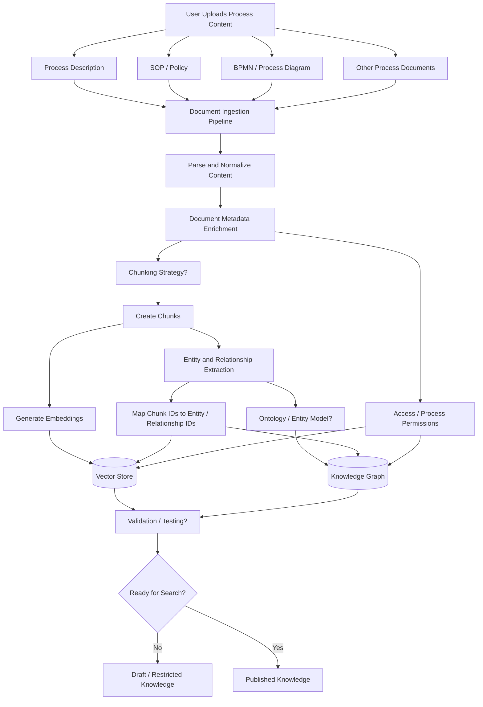
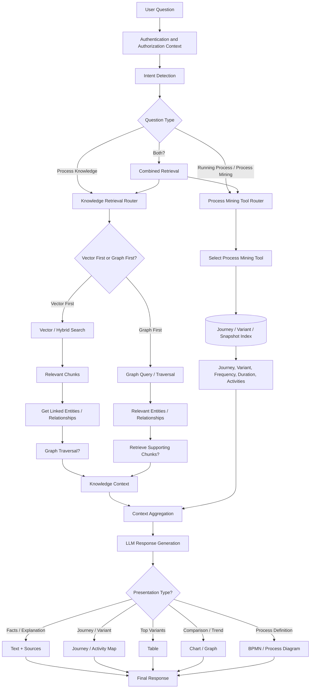

# Process Intelligence Chatbot – Current Architecture and Critical Open Questions

## 1. Knowledge Ingestion Flow

### Ingestion Steps

- User uploads process-related documents.
- Parse and normalize content from different document types.
- Add process, source, version, security, and other metadata.
- Break documents into searchable chunks.
- Generate embeddings and store chunks in the vector store.
- Extract entities and relationships from document content.
- Store entities and relationships in the knowledge graph.
- Connect chunks with graph entity and relationship IDs.
- Apply access-control metadata to both retrieval stores.
- Validate the ingested knowledge before making it searchable.

---

## 2. Real-Time Chat, Information Retrieval and Presentation Flow

### Runtime Steps

- Receive the user question with the user's authorization context.
- Detect whether the question is about documented process knowledge, observed process-mining data, or both.
- Route knowledge questions to vector search, graph search, or a combination.
- Use vector results to identify relevant graph nodes when appropriate.
- Use graph results to locate supporting document chunks when appropriate.
- Route process-mining questions to the required journey, variant, activity, or snapshot tools.
- Combine retrieved evidence before sending it to the LLM.
- Generate the response only from authorized retrieved information.
- Select the appropriate representation: text, table, chart, journey map, or BPMN/process diagram.

---

# 12 Critical Open Questions

1. **Chunking strategy?**
2. **Ontology / entity model?**
3. **Entity and relationship extraction accuracy?**
4. **Vector first or graph first?**
5. **When to stop graph traversal?**
6. **Graph-to-chunk and chunk-to-graph linking?**
7. **Hybrid retrieval and reranking strategy?**
8. **Access control across Vector DB + Graph DB + process-mining data?**
9. **Document validation before publishing to search?**
10. **Knowledge rollback and fix?**
10. **Process-mining tool boundaries and tool selection?**
11. **Representation selection: text, table, chart, journey map, BPMN?**
12. **Retrieval and answer accuracy evaluation?**
13. **How do we use users feedback to improve response?**
